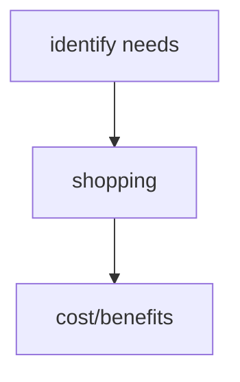
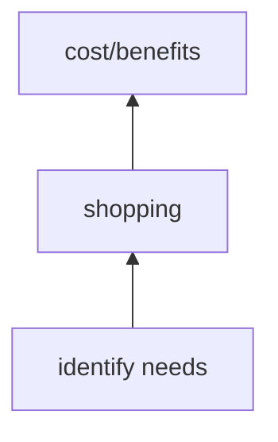
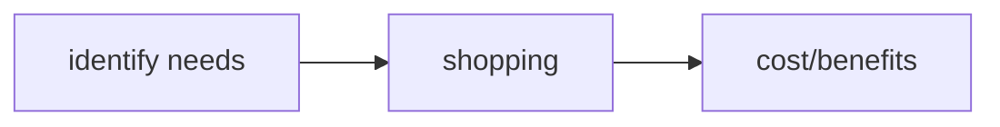
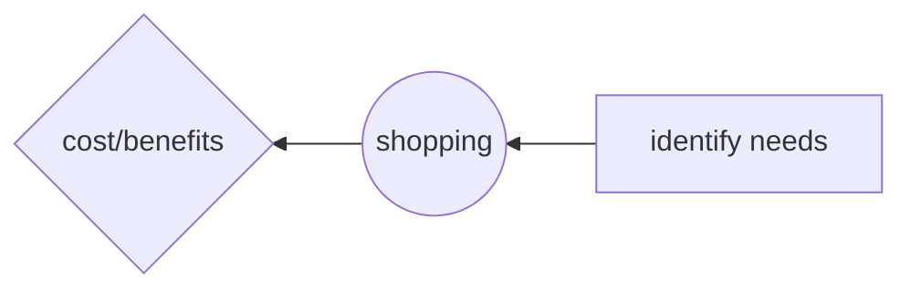
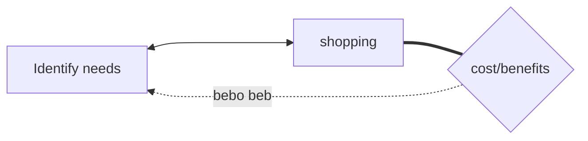
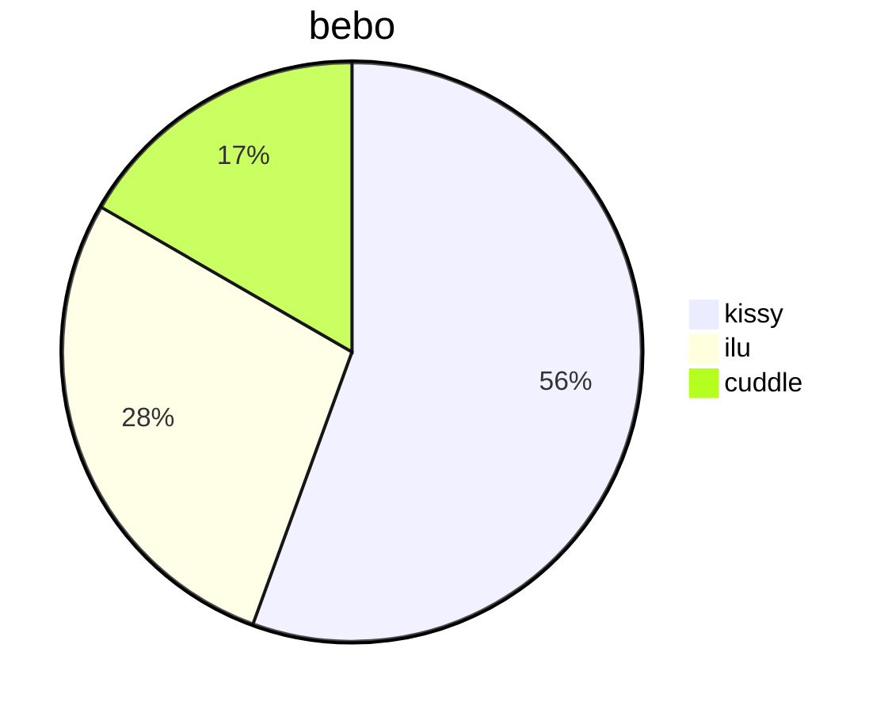
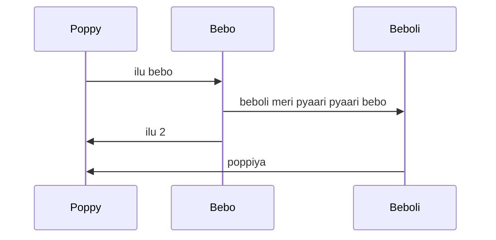
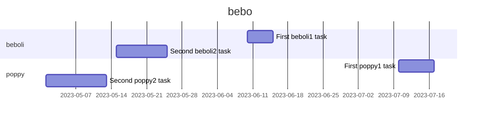

[[oop part 2#^7e41af]]   [[]] ke andar ^ to call a hashtag   


# heading
## subheading
### sub sub heading

**bold**
*italics*
_underline_
~~Strikethrough~~
[url](https://chat.openai.com/)

* raj
* h4
"raj"
\- rah

```
   add code
```

```
```
@poppy

- [ ] poppy
- [ ] bebo
- [ ] poppiya

- [ ] a
- [ ] b
- [ ] c
- [ ] alt + click for multiple cursor
- [ ] d
- [ ] e

| Header 1 | Header 2 | Header 3 |  
| -------: | :------: | :------ |  
| Item 1 | Item 2 | Item 3 |  
| Item 4 | Item 5 | Item 6 |

> [!note] Note
> This is a note.

> [!tldr] TLDR 
> Too long; didn't read.


> [!todo] info 
> Here's some information.


> [!tip] tip, hint, important 
> This is a tip


> [!success] success/check/done 
> This thing is done


> [!question] question/help/faq 
> Here's a question

> [!warning] warning/caution/attention 
> This is a warning!

> [!fail] failure/fail/missing 
> This failed!

> [!danger] danger/error 
> Error! Error!

> [!quote] quote/cite 
> This is a quote.

# math
$$ a = b + c 
 , d = e + f $$

# diagram


## mermaid compulsory than flowchart than TB(Top-Bottom) LR(Left-Right) BT or RL





## DIFFERENT SHAPE 




## Pychart



## sequence diagram




## gantt Chart



# Embed -> fit youtube video video picture file in one frame check if needed

## we can make db like query and yml like file query work for yml file
[related link](https://github.com/blacksmithgu/obsidian-dataview)

# obsidian can be stored in git by git init


